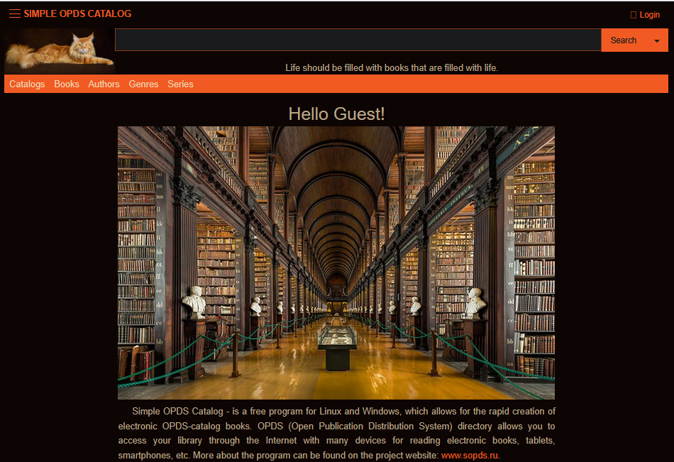

# SOPDS на Java



## О проекте

Это моя реимплементация проекта [Simple OPDS Server](https://github.com/malexple/sopds) на Java, вдохновленная оригинальной Python-версией.

## 🤔 Почему я создаю Java-версию?

Я с огромным уважением отношусь к оригинальному Python-проекту и его  сообществу. Как разработчик, я создаю эту Java-версию как альтернативную реализацию, потому что:

### 🚀 Мои цели и преимущества Java

**Производительность и стабильность**

- JVM отлично подходит для долгосрочных процессов сканирования больших библиотек
- Мне нравится эффективное управление памятью Java при обработке тысяч книг
- Нативная поддержка многопоточности для параллельного сканирования

**Экосистема, в которой я силен**

- Spring Boot ecosystem - та среда, где я чувствую себя уверенно
- JPA/Hibernate дают мне надежные инструменты для работы с базой данных
- Мне удобно работать со строгой типизацией и проверками на этапе компиляции

**Личные предпочтения в разработке**

- Java - мой основной язык, в котором я могу создавать качественный код
- Мне проще поддерживать и развивать проект на знакомом стеке технологий
- Я ценю богатую экосистему библиотек Java

## 🎯 Моя миссия

Я не пытаюсь заменить оригинальный проект, а хочу предложить альтернативу для:

- Пользователей, которые, как и я, предпочитают Java-экосистему
- Разработчиков, которым проще работать с Java
- Сообщества, заинтересованного в новых возможностях

## ✨ Что я планирую добавить

### 🧩 Система плагинов - моя главная цель

java

```
// Архитектура плагинов, которую я хочу реализовать
public interface BookProcessorPlugin {
    void process(Book book, Map<String, Object> context);
    boolean supports(String format);
}
```


### 🔍 Дополнительные возможности

- Расширенная система метаданных
- Поддержка дополнительных форматов через плагины
- Кастомные обработчики для специфических задач
- Web-интерфейс для управления плагинами

## 🤝 Мое отношение к сообществу

**Я ценю оригинальный проект и:**

- Сохраняю совместимость с OPDS-стандартом
- Стараюсь поддерживать аналогичный API где это возможно
- Уважаю работу оригинальных разработчиков

**Для пользователей Python-версии:**

- Стараюсь сделать похожий процесс установки и настройки
- Сохраняю совместимые форматы конфигурации
- Делаю знакомый интерфейс с дополнительными возможностями

## 🛠 Технические особенности, важные для меня

| Аспект                 | Python-версия    | Моя Java-версия                            |
| ---------------------- | ---------------- | ------------------------------------------ |
| **Производительность** | Хорошая          | Оптимизированная для больших библиотек     |
| **Многопоточность**    | GIL ограничения  | Нативная поддержка                         |
| **Расширяемость**      | Скрипты и модули | Система плагинов                           |
| **Типизация**          | Динамическая     | Статическая + проверки на этапе компиляции |
| **Моя экспертиза**     | Изучаю           | Глубоко понимаю                            |

## 💝 Благодарности

Хочу выразить особую благодарность:

- **Оригинальным разработчикам SOPDS** за прекрасную идею и реализацию
- **Сообществу форков** за продолжение развития проекта
- **Всем контрибьюторам** за вклад в развитие open-source OPDS-серверов

## 🚀 Мои планы по развитию

Я открыт для:

- 🔄 Обратной портировки хороших идей в Python-версию
- 🤝 Совместной работы с сообществом
- 📚 Создания единой документации для всех версий SOPDS
- 💡 Предложений и идей от других разработчиков

------

*Эта Java-реализация - мой способ сказать "спасибо" оригинальному проекту и  предложить альтернативный путь развития, используя свои сильные стороны  как Java-разработчика.*

## 📫 Связь со мной

Я всегда рад:

- Обсудить идеи по улучшению
- Получить feedback от сообщества
- Помочь другим разработчикам разобраться в коде

------

*P.S. Если когда-нибудь я созрею для Python, возможно, я внесу вклад и в  оригинальную версию. Но пока я хочу сделать лучшую версию на том стеке, в котором разбираюсь лучше всего.* 😊