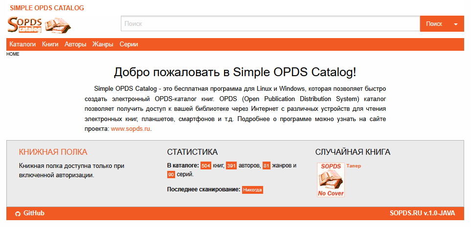

# SOPDS на Java



## О проекте

Это моя реимплементация проекта [Simple OPDS Server](https://github.com/mitshel/sopds) на Java, вдохновленная оригинальной Python-версией. Проект уже включает Web UI, Swagger/OpenAPI, OPDS-скачивание книг и чтение части форматов прямо в браузере. 

## 🤔 Почему я создаю Java-версию?

Я с огромным уважением отношусь к оригинальному Python-проекту и его сообществу. Как разработчик, я создаю эту Java-версию как альтернативную реализацию, потому что: 

### 🚀 Мои цели и преимущества Java

**Производительность и стабильность**

- JVM отлично подходит для долгосрочных процессов сканирования больших библиотек. 
- Мне нравится эффективное управление памятью Java при обработке тысяч книг. 
- Нативная поддержка многопоточности помогает развивать сканирование и фоновые задачи. 

**Экосистема, в которой я силен**

- Spring Boot ecosystem — та среда, где я чувствую себя уверенно.
- JPA/Hibernate дают мне надежные инструменты для работы с базой данных. 
- Мне удобно работать со строгой типизацией и проверками на этапе компиляции. 

**Личные предпочтения в разработке**

- Java — мой основной язык, в котором я могу создавать качественный код. 
- Мне проще поддерживать и развивать проект на знакомом стеке технологий. 
- Я ценю богатую экосистему библиотек Java. 

## 🎯 Моя миссия

Я не пытаюсь заменить оригинальный проект, а хочу предложить альтернативу для: 

- Пользователей, которые, как и я, предпочитают Java-экосистему. 
- Разработчиков, которым проще работать с Java. 
- Сообщества, заинтересованного в новых возможностях. 

## ✨ Что я планирую добавить

### 🧩 Система плагинов — моя главная цель

```java
public interface BookProcessorPlugin {
    void process(Book book, Map<String, Object> context);
    boolean supports(String format);
}
```

### 🔍 Дополнительные возможности

- Расширенная система метаданных. 
- Поддержка дополнительных форматов через плагины. 
- Кастомные обработчики для специфических задач. 
- Web-интерфейс для управления плагинами. 

## 🤝 Мое отношение к сообществу

**Я ценю оригинальный проект и:**

- Сохраняю совместимость с OPDS-стандартом. 
- Стараюсь поддерживать аналогичный API где это возможно. 
- Уважаю работу оригинальных разработчиков. 

**Для пользователей Python-версии:**

- Стараюсь сделать похожий процесс установки и настройки. 
- Сохраняю совместимые форматы конфигурации. 
- Делаю знакомый интерфейс с дополнительными возможностями. 

## 🛠 Технические особенности

| Аспект | Python-версия | Моя Java-версия |
|---|---|---|
| **Производительность** | Хорошая  | Оптимизированная для больших библиотек  |
| **Многопоточность** | GIL ограничения  | Нативная поддержка  |
| **Расширяемость** | Скрипты и модули  | Система плагинов  |
| **Типизация** | Динамическая  | Статическая + проверки на этапе компиляции  |
| **Моя экспертиза** | Изучаю  | Глубоко понимаю  |

## 🚀 Текущий статус проекта

Сейчас в проекте уже реализованы следующие возможности: Web UI на Thymeleaf, поиск и навигация по каталогу, сканирование библиотеки, OPDS-скачивание книг, Swagger/OpenAPI и чтение книг в браузере для `FB2`, `TXT`, `PDF` и `DJVU`. 

Поддерживаются как обычные файлы книг, так и чтение книг из zip-архивов через `BookFileService`. Последний прикладной фикс — чтение и скачивание книг теперь используют эффективный путь библиотеки из настроек `SOPDS_ROOT_LIB`, а не только значение по умолчанию из `application.yml`. [file:204]

Подробный статус развития проекта и backlog находятся в отдельной дорожной карте. 

## 🧪 Что уже работает

- Сканирование библиотеки и сохранение книг в БД. 
- Web UI: поиск книг, авторов, серий, жанров и навигация по каталогам. 
- Чтение книг в браузере через `/read/{id}`. 
- OPDS скачивание через `/opds/download/{id}/{zip}`. 
- Swagger UI и OpenAPI endpoint. 
- Базовая конфигурация через `application.yml` и runtime-настройки, включая корневую директорию библиотеки. [file:204]

## ▶️ Запуск

### Требования

- Java 21. 
- PostgreSQL. 
- Gradle 8.x, если запускать без wrapper-сборки из IDE или локального окружения. 

### Локальный запуск

```bash
./gradlew bootRun
```

### Сборка jar

```bash
./gradlew clean build
```

### Запуск jar

```bash
java -jar build/libs/sopds-*.jar
```

После запуска доступны:

- Web UI: `http://localhost:8080/` 
- Swagger UI: `http://localhost:8080/swagger-ui.html` 
- OpenAPI Spec: `http://localhost:8080/api-docs` 

## ⚙️ Настройка библиотеки

Корневая директория библиотеки задается через `sopds.rootLib` в конфигурации приложения, а также может использоваться runtime-настройка `SOPDS_ROOT_LIB`. Базовые свойства проекта описаны через `SopdsProperties`, где по умолчанию есть `rootLib`, `bookExtensions`, `scanOnStartup` и `maxItems`. [file:204]

Если путь к библиотеке меняется через настройки, чтение и скачивание книг должны использовать именно актуальное значение `SOPDS_ROOT_LIB`. Это важно для сценариев, где приложение запускается с одним дефолтным путём, а фактическая библиотека настраивается позже через UI или конфиг в БД. [file:204]

## 🗺 Дорожная карта

Текущий план миграции и разработки вынесен в отдельный файл: [plan.md](plan.md). В нём отражены этапы миграции, статус компонентов и backlog следующих функций, включая EPUB reader, OPDS 1.2 catalog, bookmarks, Telegram Bot и плагины конвертации. 

## 📦 Релизный процесс

Работа над изменениями может вестись в отдельной ветке. Перед выпуском релиза рекомендуется такой порядок:

1. Довести изменения в рабочей ветке и проверить локально запуск, сканирование, чтение и скачивание книг. 
2. Смёржить рабочую ветку в `master`. 
3. Создать тег релиза вида `v0.2`. 
4. Запушить `master` и тег в удалённый репозиторий. 
5. Выпустить GitHub Release и приложить собранный jar, либо использовать GitHub Actions workflow для автоматической сборки артефакта релиза. 

Пример команд:

```bash
git checkout master
git merge <feature-branch>
git push origin master

git tag v0.2
git push origin v0.2
```

## 💝 Благодарности

Хочу выразить особую благодарность:

- **Оригинальным разработчикам SOPDS** за прекрасную идею и реализацию. 
- **Сообществу форков** за продолжение развития проекта. 
- **Всем контрибьюторам** за вклад в развитие open-source OPDS-серверов. 

## 🚀 Мои планы по развитию

Я открыт для:

- 🔄 Обратной портировки хороших идей в Python-версию. 
- 🤝 Совместной работы с сообществом. 
- 📚 Создания единой документации для всех версий SOPDS. 
- 💡 Предложений и идей от других разработчиков. 

## 📫 Связь со мной

malexple@gmail.com 

Я всегда рад:

- Обсудить идеи по улучшению. 
- Получить feedback от сообщества. 
- Помочь другим разработчикам разобраться в коде. 

---

*Эта Java-реализация — мой способ сказать "спасибо" оригинальному проекту и предложить альтернативный путь развития, используя свои сильные стороны как Java-разработчика.* 